<div align=center>
 
</div>

<div align=center>
 
</div>

<!-- waka-box start -->
#### <a href="https://gist.github.com/ddee6660ea4819d749c4393b4cc8e382" target="_blank">📊 Weekly development breakdown</a>
```text
TypeScript   🕓 3h57m ███████▊░░░░░░░░░░░░░░░░░░ 30.2%
Vue          🕓 3h11m ██████▎░░░░░░░░░░░░░░░░░░░ 24.4%
TOML         🕓 2h4m  ████▏░░░░░░░░░░░░░░░░░░░░░ 15.9%
Markdown     🕓 44m   █▍░░░░░░░░░░░░░░░░░░░░░░░░  5.7%
HTTP         🕓 26m   ▉░░░░░░░░░░░░░░░░░░░░░░░░░  3.4%
```
<!-- Powered by https://github.com/YouEclipse/waka-box-go . -->
<!-- waka-box end -->

<div align=center>
 <kbd> </kbd>
</div>
